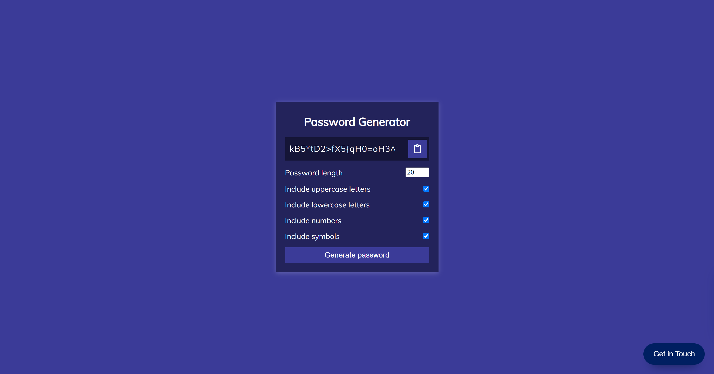

# VANILLA JS - Custom Password Generator

### Live Demo

https://passw0rd.netlify.app/

### About

Really fun project that harkens back to my old Boot Camp days where we generate a random password for the user, based on what was inputted. The user can pick the length of the password, and if the password should include various types of characters: uppercase, lowercase, numbers and symbols.

Once a password is generated, the user can click the clipboard icon to automatically copy the newly-generated password to the clipboard, and then paste it wherever they made need it.



### Relevant Code

generate a random lowercase char:

```
function getRandomLower() {
  return String.fromCharCode(Math.floor(Math.random() * 26) + 97);
}

```

filter out unchecked (false) values:

```
const typesArr = [{ lower }, { upper }, { number }, { symbol }].filter(
    (item) => Object.values(item)[0]
  );


```

copy to clipboard:

```
 const textarea = document.createElement("textarea");
  const password = resultEl.innerText;
  if (!password) {
    return;
  }

  textarea.value = password;
  document.body.appendChild(textarea);
  textarea.select();
  document.execCommand("copy");
  textarea.remove();
  alert("Password copied to clipboard!");


```

### Acknowlegement

Thanks to Traversy Media for another amazing tutorial.
